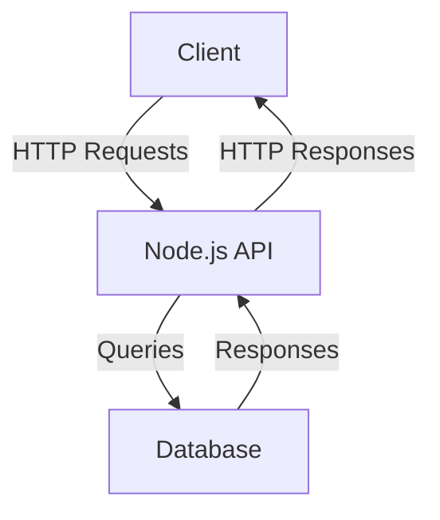
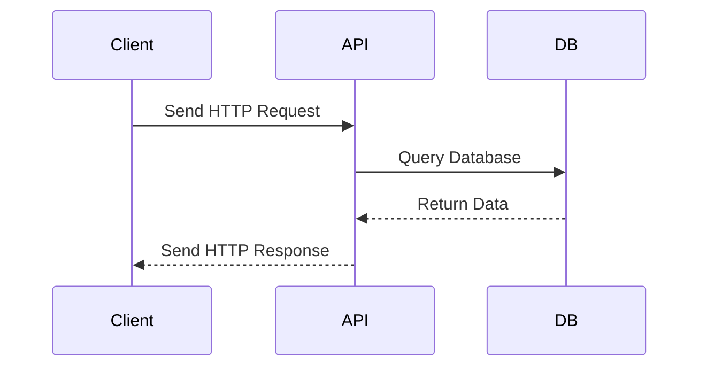

# Sample Node.js Application

This document provides an overview of a sample Node.js application, including its architecture and workflow.

## Application Overview

The sample Node.js application is a RESTful API that performs CRUD operations on a database.

## Architecture Diagram



## Workflow Diagram



## Key Features

- **RESTful API**: Handles HTTP methods (GET, POST, PUT, DELETE).
- **Database Integration**: Connects to a database for data persistence.
- **Error Handling**: Implements robust error handling mechanisms.

## Getting Started

1. Clone the repository:
   ```bash
   git clone https://github.com/your-repo/sample-nodejs-app.git
   ```
2. Install dependencies:
   ```bash
   npm install
   ```
3. Start the application:
   ```bash
   npm start
   ```

## Reference Links

- [Node.js Documentation](https://nodejs.org/en/docs/)
- [Express.js Guide](https://expressjs.com/)
- [Mermaid.js Documentation](https://mermaid-js.github.io/mermaid/)
